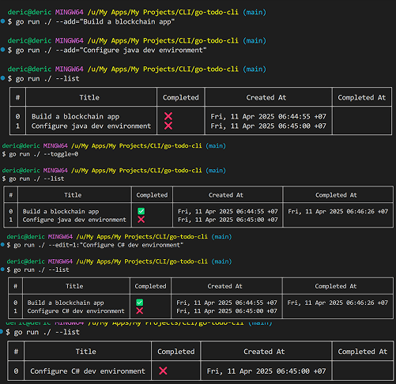

# Golang Todo CLI

## Overview

**Golang Todo CLI** is a command-line application for creating, reading, updating, and deleting todos with toggle functionality.

## Features

### ✅ Current Features:
- CRUD operations for todos
- Toggle todo completion status

## Installation

To get started with the **Golang Todo CLI**, follow these steps:

1. **Clone the repository:**

    ```bash
    git clone https://github.com/muhammadderic/go-todo-cli.git
    cd go-todo-cli
    ```

2. **Build the application:**

    ```bash
    go build
    ```

3. **Run the application:**

    ```bash
    ./go-todo-cli
    ```

## Screenshots

<div style="display: flex; justify-content: space-between;">
    
</div>

*terminal*

## Technologies Used

- **Golang** – The core programming language used to build the application
- **github.com/aquasecurity/table** – Package used for displaying todos in a formatted table

## Contributing

Contributions are welcome! If you'd like to contribute to this project, please follow these steps:

1. Fork the repository.
2. Create a new branch for your feature or bugfix.
3. Commit your changes and push your branch.
4. Open a pull request to have your changes reviewed.

## License

This project is licensed under the MIT License. See the [LICENSE](LICENSE) file for more details.

## Contact

If you have any questions or suggestions, feel free to reach out:

- **GitHub**: [muhammadderic](https://github.com/muhammadderic)